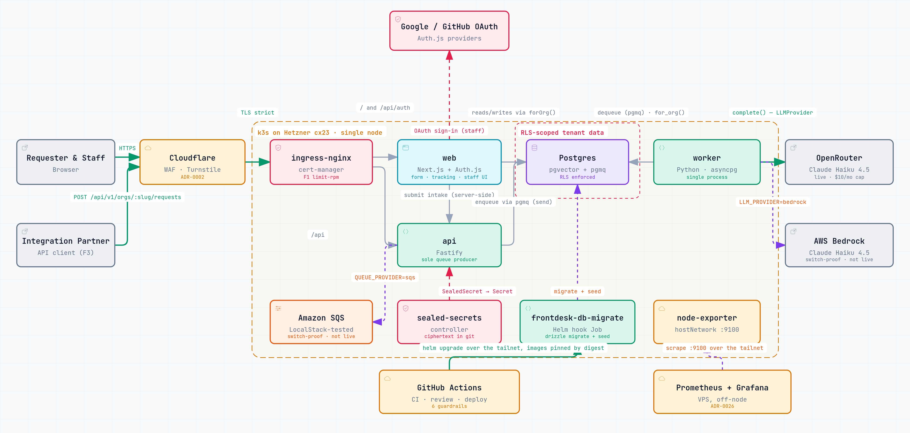

# frontdesk

An AI-assisted request desk for small businesses, built in public as an **AI-first SDLC** demonstration.

Customers submit requests through a public form. The system classifies each request, routes it to a lane, retrieves the business's own documents, and drafts a cited reply. Staff approve, edit, or reject. The engineering *process* (agents and humans on one repo, with guardrails from ideation to operations) is as much the deliverable as the product.

**Status:** deployed and serving on a single k3s node. Public intake, tracking, staff sign-in, the staff queue, request detail with citations, and approve / edit / reject with an audit trail all work end to end. Five of the six SDLC guardrails below are built and enforced; the sixth says so.

**Live:** [frontdesk.jtrent.dev](https://frontdesk.jtrent.dev) · Writeup: [I let AI agents write 94 pull requests](https://jtrent.dev/writing/ai-first-sdlc/) · Board: [projects/1](https://github.com/users/jason-trentcyber/projects/1) · Docs: [`REQUIREMENTS.md`](REQUIREMENTS.md), [`docs/adr/`](docs/adr/README.md), [`docs/AI-GOVERNANCE.md`](docs/AI-GOVERNANCE.md)

### Try it

| Surface | What it is |
|---|---|
| [`/`](https://frontdesk.jtrent.dev) | Landing page |
| [`/r/bright-smile-dental`](https://frontdesk.jtrent.dev/r/bright-smile-dental) | Public request form for the demo org — submit one and you get a tracking link |
| `/t/<token>` | Tracking page for a submitted request; unguessable token, no login |
| [`/app`](https://frontdesk.jtrent.dev/app) | Staff queue — redirects to sign-in; membership is re-resolved per request, never cached in the session |

Demo submissions are purged after 24 hours. The demo org's retrieval index is inspectable without auth: [`/api/v1/orgs/bright-smile-dental/index-info`](https://frontdesk.jtrent.dev/api/v1/orgs/bright-smile-dental/index-info) returns the embedding model, chunking strategy, HNSW parameters, and live document/chunk counts. Non-demo orgs 404 there by design — it never confirms a private org's slug is real.

## Architecture

<picture>
  <source media="(prefers-color-scheme: dark)" srcset="docs/diagrams/architecture-dark.png">
  
</picture>

**[Open the interactive version](https://jason-trentcyber.github.io/frontdesk-intake/architecture.html)** — pan, zoom, search, trace a relationship, or step through four guided views (request path, triage pipeline, switch-proof adapters, delivery and operations).

Next.js web + Fastify API + Python worker on one Helm chart, k3s on a single Hetzner node, Postgres 16 with pgvector (retrieval) and pgmq (queue), Cloudflare at the edge, OpenRouter for the LLM with a switch-proven Bedrock adapter. Decisions and rejected alternatives are in the ADRs; what the diagram asserts and where it simplifies is in [`docs/diagrams/architecture-assumptions.md`](docs/diagrams/architecture-assumptions.md).

## The AI-first SDLC story

Six guardrails, all visible in this repo. Each links to the moment it did its job.

1. **Context pack** — `CLAUDE.md`, `AGENTS.md`, `docs/conventions.md`, 36 ADRs. Agents read before they write, and an agent that disagrees with an ADR must supersede it in the same PR, never edit it.
2. **Provenance** — every PR has one `agent:*` label and a `Model:` line; co-author trailers are kept. Enforced by `pr-lint`, which also refuses to let an agent-labelled PR raise the eval baseline.
3. **Blocking review agent** — Claude Code headless reviews every PR against `docs/review-rubric.md`; `blocking` findings fail a required check. See it [block #92 seven times](https://github.com/jason-trentcyber/frontdesk-intake/pull/92#pullrequestreview-5171867592) (an ADR-0002 naming violation, among others) before that PR merged clean, and [catch a CI password placeholder in #134](https://github.com/jason-trentcyber/frontdesk-intake/pull/134) that would have broken every future merge. A human still merges.
4. **Eval gate** — `evals/run.py` runs 20 labeled requests through the shipped classifier and retrieval against the demo corpus, with LLM completions replayed from recorded fixtures so CI spends nothing ([ADR-0036](docs/adr/0036-deterministic-eval-gate.md)). Three metrics — classification accuracy, recall@5, recall@1 — may not drop below `evals/baseline.json`; `eval` is a required check on every PR. **Its first run found a production bug**: the model fences its JSON, the parser didn't strip it, accuracy measured 0.20 ([#133](https://github.com/jason-trentcyber/frontdesk-intake/issues/133)). Fixed in [#136](https://github.com/jason-trentcyber/frontdesk-intake/pull/136); the baseline was raised to 1.0 by a human in [#137](https://github.com/jason-trentcyber/frontdesk-intake/pull/137). Staff edits and rejections feed the golden set via `pnpm eval:export` ([#140](https://github.com/jason-trentcyber/frontdesk-intake/pull/140)).
5. **Governance** — `docs/AI-GOVERNANCE.md`: who may do what, what always needs a human — and a [GitHub ruleset](.github/rulesets/main.json) on `main` that enforces the table: 16 required checks, no bypass actors, the owner included.
6. **Ops loop** — [`ops/agent/`](ops/agent/): every 6 hours a Hermes cron job reads Prometheus alerts, error-shaped Loki lines and cluster state through a read-only ServiceAccount that cannot create, patch, exec or read secrets, and files an issue labeled `agent:hermes` + `ops` with quoted evidence, a hypothesis, a proposed fix and a confidence. It never applies a change; its instructions and noise list are versioned in the repo ([ADR-0040](docs/adr/0040-ops-loop-reads-prometheus-alerts-directly-no-alertmanager.md)). There is no Alertmanager — the agent is the alert consumer. Built in [#32](https://github.com/jason-trentcyber/frontdesk-intake/issues/32); the first real issue it files closes REQUIREMENTS §11's last line.

## Cost

What one triaged request costs, and where the LLM would be cheaper to own than to rent. Per-request figure is measured, not estimated ([ADR-0023 §5](docs/adr/0023-worker-runtime-shape.md): classify ≈ 600 in / 30 out, draft ≈ 2,800 in / 350 out, Claude Haiku 4.5 at $1 / $5 per million tokens = **$0.0053**). Hetzner prices are USD list as shown to a US account on 2026-09-20, before tax; Bedrock's Haiku 4.5 list price equals Anthropic's. The GPU row is a reference floor (cheapest dedicated GPU with a public list price), not a hosting plan.

| Option | Fixed / month | Per request | 50 req/mo (demo) | 500 req/mo | Break-even vs. API |
|---|---|---|---|---|---|
| **OpenRouter → Haiku 4.5** (deployed) | $6.49 node | $0.0053 | $0.27 | $2.65 | — |
| **Bedrock → Haiku 4.5** | $6.49 node; +$73 only if the cluster also moves to EKS | $0.0053 | $0.27 | $2.65 | same tokens, same price; you pay for the AWS account boundary, not the model |
| **Hetzner GEX45** (RTX PRO 4000, 24 GB) + open-weights model | $249 (+$249 setup) | ≈ $0 | $249 | $249 | ≈ **47,000 req/mo** |
| **Hetzner cx53** (16 vCPU / 32 GB) + Ollama on CPU | $34.99 | ≈ $0 | $34.99 | $34.99 | ≈ **6,600 req/mo**, at CPU latency (tens of seconds per draft) |

Reading it: below roughly 6,600 requests a month, renting tokens is cheaper than the smallest box that can run a model, and the OpenRouter key is hard-capped at $10 (≈ 1,900 requests) so a bug cannot exceed that. The GPU line is the cost of *never sending a customer's text to a vendor* — a data-residency decision, not a cost one, until volume is nearly 1,000× the demo. The Ollama adapter is [#38](https://github.com/jason-trentcyber/frontdesk-intake/issues/38); the interface it would implement is the same one Bedrock already does.

## Switch to Bedrock

1. Set `LLM_PROVIDER=bedrock` in the worker's values (never as a live edit — CLAUDE.md).
2. Set `AWS_REGION` to the target region.
3. Supply AWS credentials — IRSA in EKS, or `AWS_ACCESS_KEY_ID`/`AWS_SECRET_ACCESS_KEY` env elsewhere.
4. `LLM_MODEL` stays the same alias; `worker/llm/models.yaml` resolves it to the Bedrock model id.
5. Redeploy. `worker/llm/`'s `provider-parity` CI job already proves both adapters produce an identical normalized `Completion` for the same input.

## Run locally

Requires Node 22+, pnpm, Python 3.12, uv, and Docker **or** Podman. See `docs/conventions.md` → Toolchain.

```
git clone https://github.com/jason-trentcyber/frontdesk-intake.git
cd frontdesk-intake
cp .env.example .env
make up               # postgres (pgvector + pgmq) + localstack
pnpm install
cd worker && uv sync && uv run python scripts/fetch_model.py && cd ..
make migrate && make seed
set -a && . ./.env && set +a   # the DB-backed suites skip without these vars
make test             # vitest + pytest against the local Postgres
make eval             # the eval gate, replayed fixtures, no API key needed
```

Podman instead of Docker: prefix every `make` target with `CONTAINER=podman`, e.g. `CONTAINER=podman make up`. The LLM runs as `LLM_PROVIDER=fake` by default - no vendor key needed to run everything above.

## Caveats

Single node, no HA (Hetzner cx23, 4 GB). Metrics and logs ship to a separate monitoring host rather than running Prometheus/Loki on the node (ADR-0010). This is a demo with a real production posture, not a production service. No PHI, no real personal data; seed data is fictional and demo submissions are purged after 24 hours.

## License

Apache-2.0.
